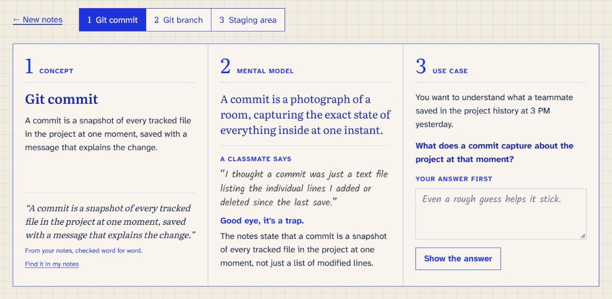

# Mental Click

Paste your notes and walk each concept through the three steps I use to actually understand
something: the concept, a mental model, and a real use case. Every quote is checked against your
own notes.



**Try it:** [mental-click.vercel.app](https://mental-click.vercel.app/) (bring a free Gemini key)

## How it works

1. Paste lecture notes, a textbook section or your own summary, and pick how many concepts (1 to 5).
2. For each concept you get a CMU (concept, mental model, use case) card with three panels:
   - **Concept.** What it is in plain words, plus the exact sentence from your notes that
     supports it. "Find it in my notes" highlights that sentence.
   - **Mental model.** An everyday picture to hold the idea by. Then a classmate says something
     wrong about it, and you decide if it sounds right before the correction appears.
   - **Use case.** A realistic situation and a question. You write your answer first, then
     reveal it.
3. Nothing is saved. Close the tab and it's gone.

## Why it's built this way

I didn't want another flashcard app that shows you the answer and lets you nod along. The
design comes from a few well-studied effects:

- **Wrong ideas get corrected out loud.** Stating a misconception and then refuting it (refutation
  text) beats plain explanation in controlled studies. A 2022 meta-analysis found a moderate effect,
  g = 0.41 ([Educational Psychology Review](https://pubmed.ncbi.nlm.nih.gov/35095236/)).
- **You guess before you see.** Trying to answer first, even when the guess is wrong, improves
  what you remember once the right answer arrives ([pretesting effect, Memory &
  Cognition](https://link.springer.com/article/10.3758/s13421-025-01813-x)).
- **Abstract ideas need something concrete to stick to.** That's what the mental model and the
  use case are for ([concreteness fading
  review](https://link.springer.com/article/10.1007/s10648-014-9249-3)).

## The interesting parts

**Every card has to prove itself.** The model must quote one sentence from your notes, word for
word. The server then checks that quote against the notes (ignoring whitespace and Markdown
symbols) and the card says whether it matched. It's a small, measurable guard against the model
making things up, and it's the first step toward the accuracy evals I want to add next.

**Your key never gets stored, but it does pass through my server.** I wanted calls to go straight
from the browser to the provider, but Gemini's endpoints block browser requests. So the API route
is a stateless pass-through: the key arrives in a header, is used for one request, and is never
logged. On the page, a strict nonce-based Content Security Policy means only this app's own
scripts run, and all model output is rendered as text, since pasted notes could carry prompt
injection. The full reasoning is in [SECURITY.md](SECURITY.md). The safest move is still to use a
throwaway key.

**The prompt was developed with tests, not vibes.** `scripts/run_prompt.py` runs the system prompt
against a set of notes files and checks every output: valid JSON, all three panels filled, quotes
verbatim, misconceptions in first person, the right card count. Versions v9 to v11 in
[`prompts/`](prompts/) each fixed something those checks caught, like a model padding the output
with an example as its own concept. Different models also format differently (Gemini drops the
`<analysis>` tags), so the parser finds the JSON wherever it lands.

## Run it locally

Requires Node 20.9+ (22 or 24 recommended).

```bash
git clone https://github.com/CynthiaSalazarB/mental-click.git
cd mental-click
npm install
npm run dev
```

Open http://localhost:3000 and paste a key into the app. No environment variables are needed to
run the app.

To run the prompt tests (Python 3, `pip install openai python-dotenv`), copy `.env.example` to
`.env`, add a key, then:

```bash
python scripts/run_prompt.py tests/inputs/*.md --cards 3 --provider gemini
```

## Stack

| Tool | Role |
|---|---|
| Next.js 16 + TypeScript | App and the `/api/generate` route handler |
| Tailwind CSS v4 | Reset and base; the design is hand-written CSS tokens |
| Gemini (`gemini-3.5-flash-lite`) or OpenRouter | The model, through each provider's OpenAI-compatible endpoint |
| Vercel | Hosting |

## Made by

Cynthia Salazar. I make content about building things and learning in public on Instagram
([@cynthias.dev](https://www.instagram.com/cynthias.dev/)), and I'm on
[LinkedIn](https://www.linkedin.com/in/cynthia-salazarb/).

## License

[MIT](LICENSE)
